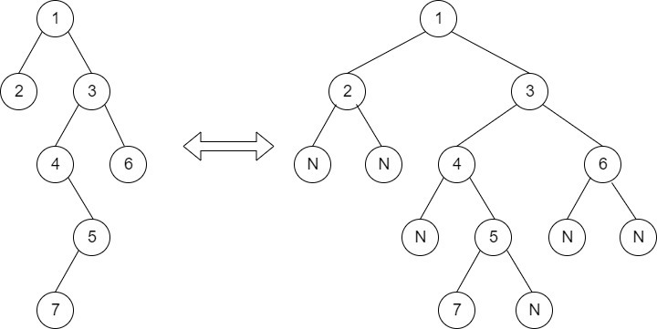
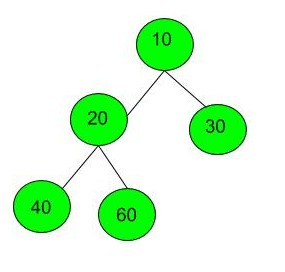

Given a Binary Tree, print Left view of it. Left view of a Binary Tree is set of nodes visible when tree is visited from Left side. The task is to complete the function leftView(), which accepts root of the tree as argument.

Left view of following tree is 1 2 4 8.

          1
       /     \
     2        3
   /     \    /    \
  4     5   6    7
   \
     8   

Input:
The first line of input contains the number of test cases T. For every test case, the first line of input contains two space-separated integers, denoting node values for which we want to find LCA,  and the second line will contain a string representing the tree as described below: 

The values in the string are in the order of level order traversal of the tree where, numbers denote node values, and a character “N” denotes NULL child.

For example:

 
For the above tree, the string will be: 1 2 3 N N 4 6 N 5 N N 7 N

Output:
The function should print nodes in left view of Binary Tree.

User Task:
Since this is a functional problem you don't have to worry about input, you just have to complete the function leftView() that prints the left view. The newline is automatically appended by the driver code.
Expected Time Complexity: O(N).
Expected Auxiliary Space: O(Height of the Tree).

Constraints:
1 <= T <= 100
1 <= Number of nodes <= 100
1 <= Data of a node <= 1000

Example:
Input:
2
1 3 2
10 20 30 40 60 N N
Output:
1 3
10 20 40

Explanation:
Testcase 1: Below is the given tree with its nodes
         1                   
       /     \
     3        2
Here left view of the tree will be 1 3.
Testcase 2: below is a given tree with its nodes.

We can clearly see that nodes which are at left view of tree they are 10 20 40.

Note: The Input/Output format and Example given are used for the system's internal purpose, and should be used by a user for Expected Output only. As it is a function problem, hence a user should not read any input from the stdin/console. The task is to complete the function specified, and not to write the full code.