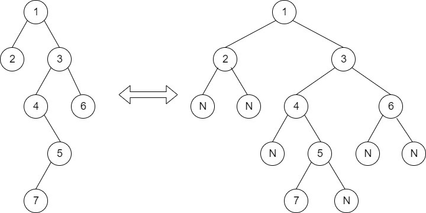

Check for BST 
Given a binary tree. Check whether it is a BST or not.

Input:
The first line of input contains the number of test cases T. Each test case contains a string representing the tree as described below: 

The values in the string are in the order of level order traversal of the tree where, numbers denote node values, and a character “N” denotes NULL child.

For example:

 
For the above tree, the string will be: 1 2 3 N N 4 6 N 5 N N 7 N

Output:
The function should return 1 if BST else return 0.

Your Task:
You don't need to read input or print anything. Your task is to complete the function isBST() which takes the root of the tree as a parameter and returns true if the given binary tree is BST, else returns false.

Expected Time Complexity: O(N).
Expected Auxiliary Space: O(Height of the BST).

Constraints:
1 <= T <= 10
0 <= Number of edges <= 100000

Example:
Input:
2
2 1 3
2 N 7 N 6 N 5 N 9 N 2 N 6
Output:
1
0

Explanation:
Testcase 1: The given Binary Tree is:
    2
  /    \ 
1      3
This is clearly a BST. Hence the output is 1.

Note: The Input/Output format and Example are given are used for the system's internal purpose, and should be used by a user for Expected Output only. As it is a function problem, hence a user should not read any input from the stdin/console. The task is to complete the function specified, and not to write the full code.