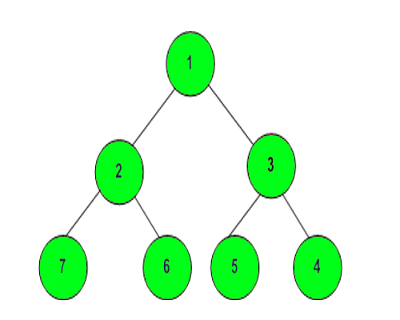

Level order traversal in spiral form 
Complete the function to print spiral order traversal of a tree. For below tree, function should print 1, 2, 3, 4, 5, 6, 7.

 
 

Input:
First line of input contains the number of test cases T. For each test case, there will be only a single line of input which is a string representing the tree as described below: 

The values in the string are in the order of level order traversal of the tree where, numbers denotes node values, and a character “N” denotes NULL child.

For example:

For the above tree, the string will be: 1 2 3 N N 4 6 N 5 N N 7 N

Output:
The function should print level order traversal in spiral form.

Your Task:
The task is to complete the function printSpiral() which prints the elements in spiral form of level order traversal. The newline is automatically appended by the driver code.
Expected Time Complexity: O(N).
Expected Auxiliary Space: O(N).

Constraints:
1 <= T <= 30
0 <= Number of nodes <= 105
1 <= Data of a node <= 105

Example:
Input:
2
1 3 2  
10 20 30 40 60 
Output:
1 3 2
10 20 30 60 40 

Explanation:
Testcase1: The tree is
        1
     /      \
   3       2
So, the spiral level order would be 1 3 2
Testcase2: The tree is
                           10
                        /        \
                     20         30
                  /       \
               40       60
So, the spiral level order would be 10 20 30 60 40
 

Note: The Input/Ouput format and Example given are used for system's internal purpose, and should be used by a user for Expected Output only. As it is a function problem, hence a user should not read any input from stdin/console. The task is to complete the function specified, and not to write the full code.